# 자바스크립트 비동기 처리과정
권영근

---

## 자바스크립트 엔진
자바스크립트 엔진 = 하나의 쓰레드에서 동작

하나의 쓰레드를 가지고 있다는 것 = 하나의 stack을 가지고 있다

하나의 stack이 있다는 것 = 동시에 단 하나의 작업만 가능하다.

---
## 그럼 비동기 처리는 어디서 이루어 지는가?
자바스크립트 엔진이 처리하는 것이 아니다!

자바스크립트 엔진은 하나의 코드 조각을 하나씩 실행하기만 한다.
<br><br>
비동기적으로 이벤트를 처리하거나 Ajax 통신을 하는 작업은 사실상 **Web API**에서 **모두** 처리된다.

---
자바스크립트가 동시에 단 하나의 작업만을 한다는데 어떻게 여러가지 작업을 비동기로 작업을 할수 있을까?

---
## Event Loop 와 Queue

- Event Loop는 계속 반복해서 call stack과 queue 사이의 작업들을 확인하고, call stack이 비워있는 경우 queue에서 작업을 꺼내어 call stack에 넣는다.

- 자바스크립트는 이 Event Loop와 Queue들을 이용하여 비동기 작업을 수행한다.

- 직접적인 작업은 Web API에서 처리되고, 그 작업들이 완료되면 요청시 등록했던 callback이 queue에 등록된다
---
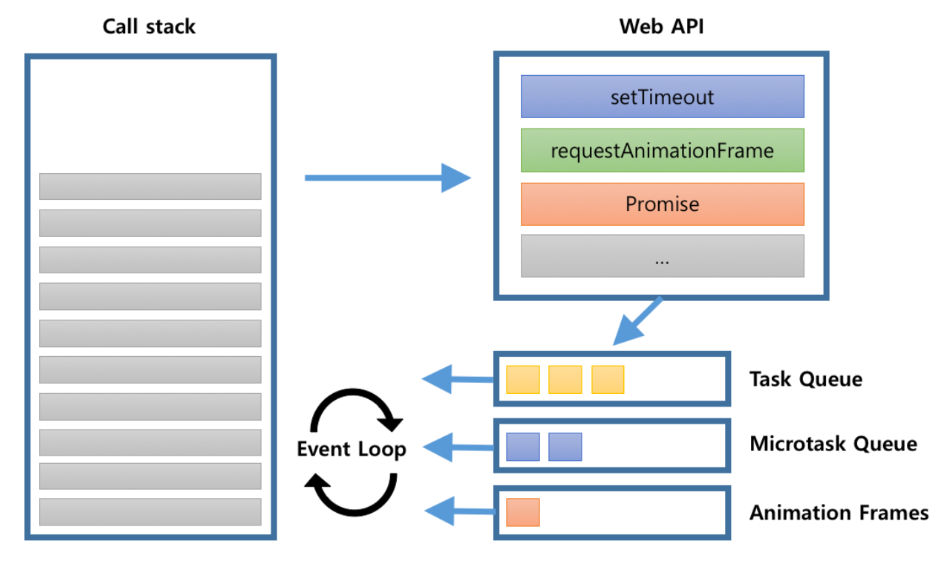

---
아래 코드 결과는?
```javascript
console.log("script start");

setTimeout(function() {
  console.log("setTimeout");
}, 0);

Promise.resolve().then(function() {
  console.log("promise1");
}).then(function() {
  console.log("promise2");
});

requestAnimationFrame(function {
    console.log("requestAnimationFrame");
})
console.log("script end");
```
---
```shell
script start
script end
promise1
promise2
requestAnimationFrame
setTimeout
```

---
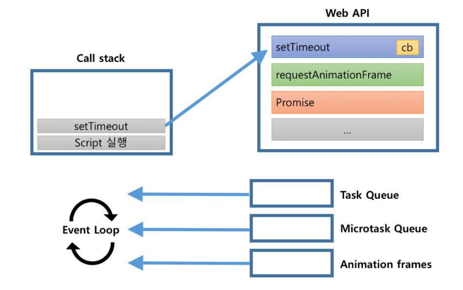

```javascript
setTimeout(function() {
  console.log("setTimeout");
}, 0);
```

---
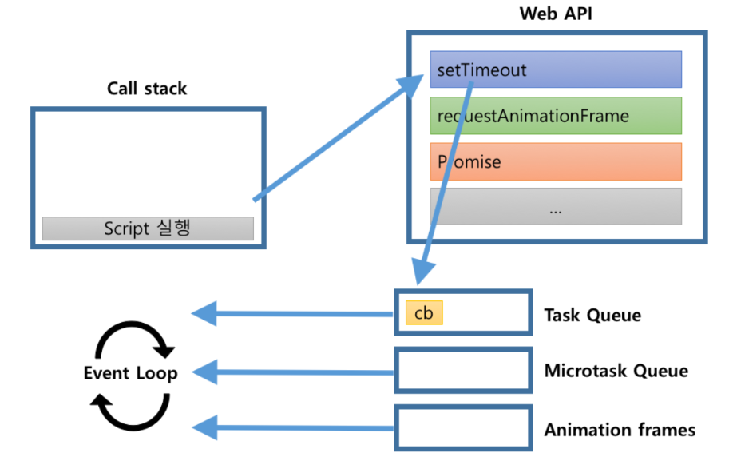
```javascript
setTimeout(function() {
  console.log("setTimeout");
}, 0);
```
---
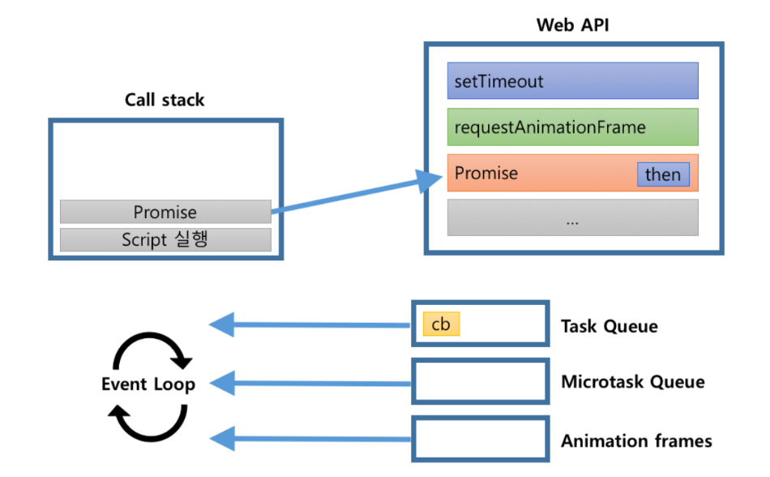
```javascript
Promise.resolve().then(function() {
  console.log("promise1");
}).then(function() {
  console.log("promise2");
});
```
---
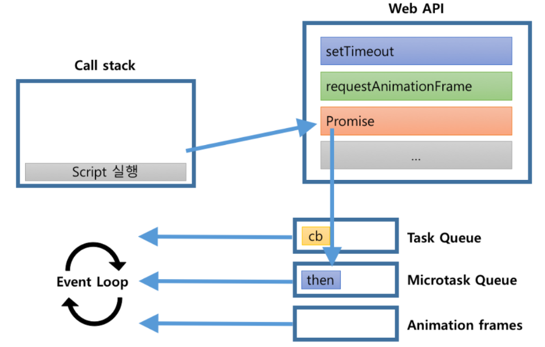
```javascript
Promise.resolve().then(function() {
  console.log("promise1");
}).then(function() {
  console.log("promise2");
});
```
---
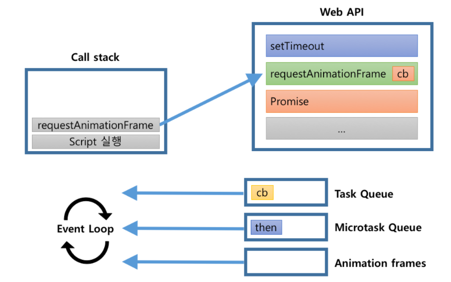
```javascript
Promise.resolve().then(function() {
  console.log("promise1");
}).then(function() {
  console.log("promise2");
});
```
---
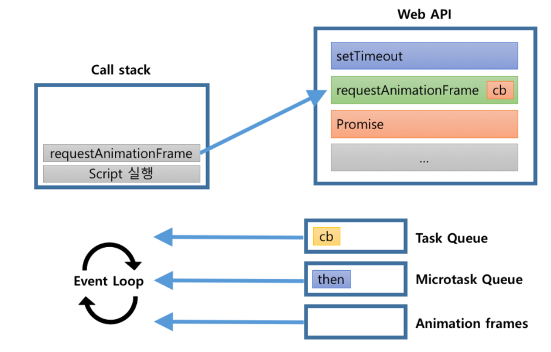
```javascript
requestAnimationFrame(function {
    console.log("requestAnimationFrame");
})
```
---
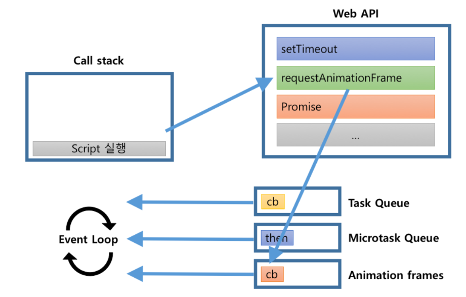
```javascript
requestAnimationFrame(function {
    console.log("requestAnimationFrame");
})
```
---

콜 스택에 담기는 순서는 다르다.

---
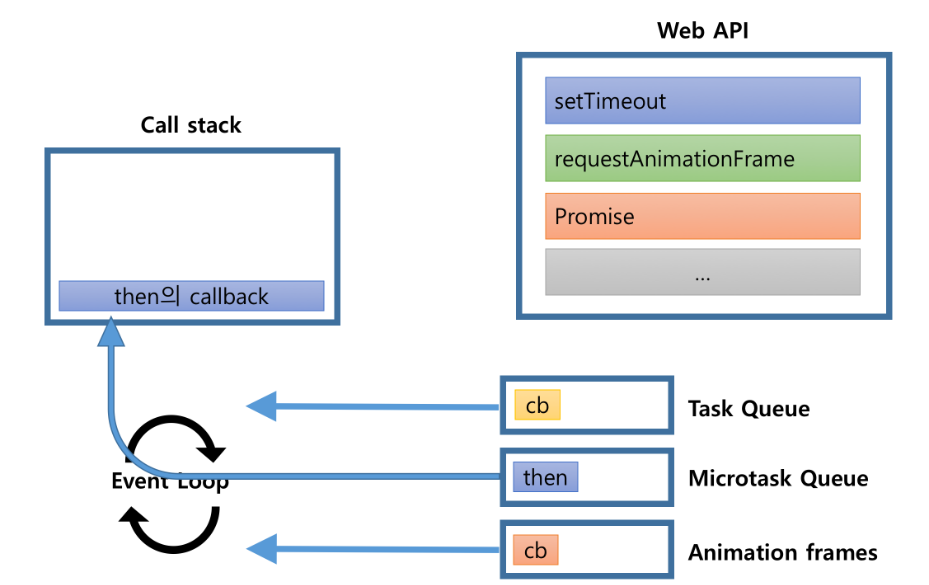

---
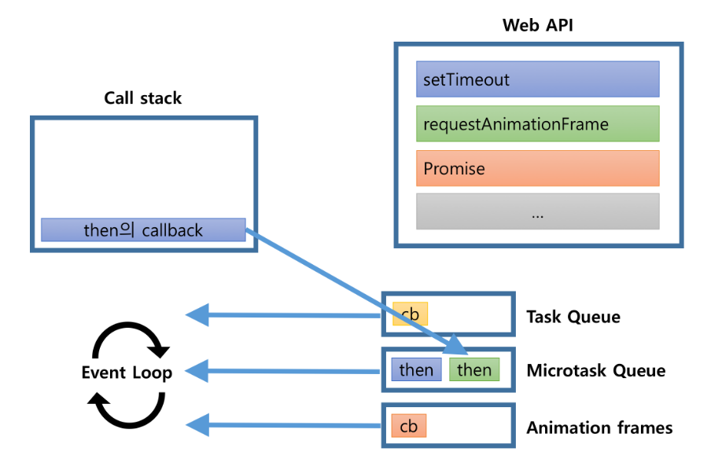

---
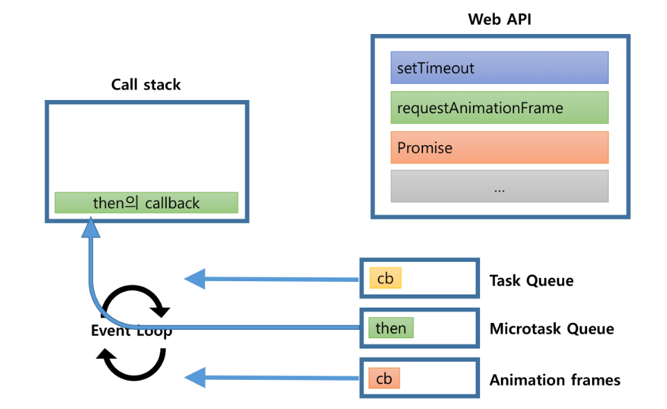

---
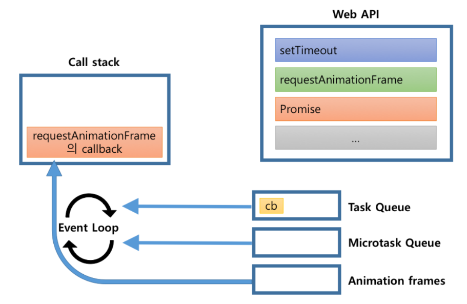

---
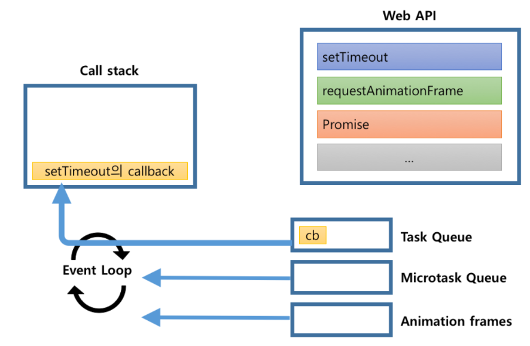

---
## 최종 정리

- 비동기 작업으로 등록되는 작업은 task와 microtask. 그리고 animationFrame 작업으로 구분.
- microtask는 task보다 먼저 작업이 처리된다.
- microtask가 처리된 이후 requestAnimationFrame이 호출되고 이후 브라우저 랜더링이 발생한다.

---
## 출처
- http://sculove.github.io/blog/2018/01/18/javascriptflow/