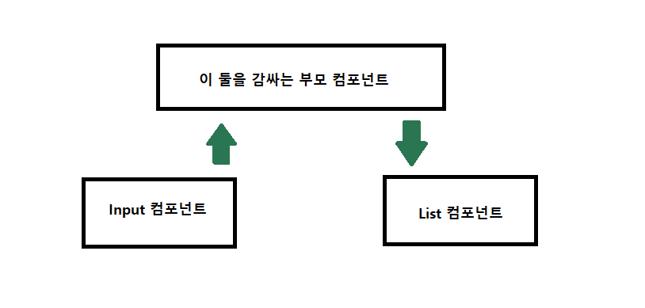
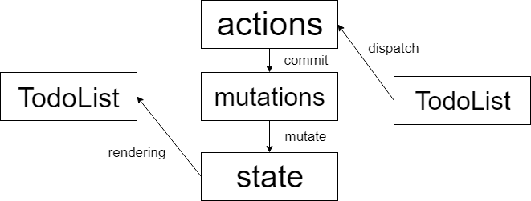

# Vuex
권영근

---
## 먼저 Vue.js 특징!
- Vue.js는 컴포넌트 형식의 프레임워크다!
- 끗
- 그래서 간편한 듯
---

- 요로코롬.
- HTML의 돔 구조와 똑같다.
- 하나하나가 대신 Vue 컴포넌트(.vue파일)로 되어있다.

---
### Vue파일로 따로따로 존재한다면 통신은 어떻게?
- 예를 들어
	

---
### 슬프게도 형제 컴포넌트간 통신이 불가능하다...
- Vue는 부모자식간의 컴포넌트 통신만 가능하다.
- 그래서 형제 컴포넌트끼리 통신하기 위해 부모컴포넌트를 거쳐 통신하는 수 밖에 없다...
---
- 요렇게...


---
## 그래서 등장한 것이 Vuex

---
## Vuex란?
-  Vue.js 애플리케이션에 대한 **상태 관리 패턴** + **라이브러리**
- 쉽게 풀이해 **모든 컴포넌트의 중앙 저장소**
---
## 3가지 중요한 속성
- actions : 사용자 입력에 반응하는 함수 집약
- mutations: state에 데이터를 set
- state: 데이터가 저장되는 곳
---


---
```javascript
new Vue({
  // 데이터 = 상태(state) 
  data () {
    return {
      count: 0
    }
  },
  // 뷰
  template: `
    <div>{{ count }}</div>
  `,
  // 메서드 = 액션(action)
  methods: {
    increment () {
      this.count++
    }
  }
})
```
---
```javascript
//actions.js
import { fetchNewsList, fetchUserInfo } from '../api/index.js';

export default {
    FETCH_NEWS(context) {
        fetchNewsList()
            .then((response) => {
                context.commit('SET_NEWS', response.data);
            })
            .catch(error => console.log(error));
    },
    
    FETCH_USER({ commit }, name) {
        fetchUserInfo(name)
            .then(({ data }) => {
                commit('SET_USERS', data);
            })
            .catch(error => console.log(error));
    }
}
```
---
```javascript
// mutations.js
export default {
    SET_NEWS(state, newsData){
        state.news = newsData;
    },
    
    SET_USERS(state, userData){
        state.users = userData;
    }
}
```
---
```javascript
import Vue from 'vue';
import Vuex from 'vuex';
import mutations from './mutations.js';
import actions from './actions.js';

Vue.use(Vuex);

export const store = new Vuex.Store({
    state:{
        news:[],
        users:[],
    },
    
    getters:{
        fetchedNews(state){
            return state.news;
        },
        fetchedUsers(state){
            return state.users;
        }
    },
    mutations,
    actions
});
```
---
```javascript
const moduleA = {
  state: { ... },
  mutations: { ... },
  actions: { ... },
  getters: { ... }
}

const moduleB = {
  state: { ... },
  mutations: { ... },
  actions: { ... }
}

const store = new Vuex.Store({
  modules: {
    a: moduleA,
    b: moduleB
  }
})

```
---
## 최종정리
- Vuex
	- 중앙 데이터 저장소 이면서 상태 관리 라이브러리 
	- actions, mutations, state
	