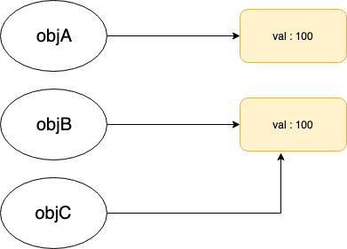
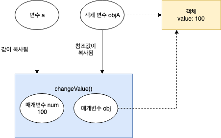
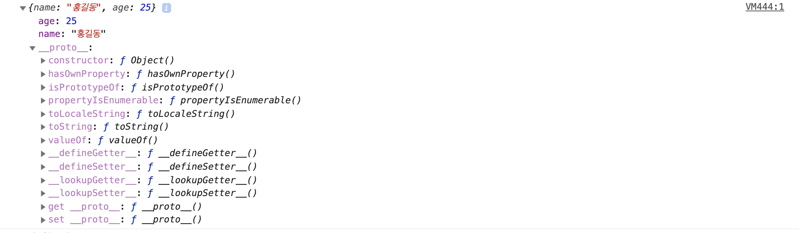
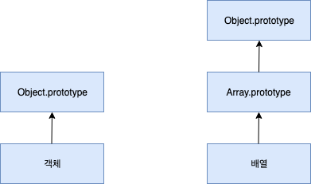

# 1.자바스크립트 데이터 타입과 연산자

## 1.1 자바스크립트 데이터 타입

### 기본 타입

- 숫자(Number)
- 문자열(String)
- 불린값(Boolean)
- undefined
- null

### 참조 타입

- 객체(Object)
  - 배열(Array)
  - 함수(Function)
  - 정규표현식

---

## 1.2 숫자(Number)

- 모든 숫자 64비트 부동 소수점 형태( C언어의 double 타입 같은 )
- 나눗셈 연산 주의 🖐
  - 정수도 실수로 취급
    ```javascript
    var num = 5 / 2;
    console.log(num); // 2.5
    console.log(Math.floor(num)); // 2
    ```

---

## 1.3 문자열(String)

- C언어의 char타입 존재 X
- 한번 정의된 문자열은 **수정불가** 🖐
  ```javascript
  var str = "nice";
  str[0] = "N";
  console.log(str); // nice
  ```

---

## 1.4 불린값(Boolean)

- true
- false

---

## 1.5 null과 undefined

- 타입이면서 그 자체가 값
- 값이 비어있음을 나타냄

### undefined

- 값이 할당되지 않은 변수
- 순수한 '무'

### null

- 개발자가 **명시**한 빈 값
- `typeof`의 결과가 `object` 🖐
  ```javascript
  var nullVar = null;
  console.log(typeof nullVar === null); // false
  console.log(nullVar === null); // true
  ```

---

# 2. 자바스크립트 참조타입(객체 타입)

- 기본 타입을 제외한 모든 타입은 객체
  - 배열, 함수, 정규표현식
- 객체의 프로퍼티는 `기본타입의 값`, `다른 객체`를 가르킬 수 있음

---

## 2.1 자바스크립트 객체 모습

```javascript
var ObjectVar = {
  propertyName: value,
  propertyName: method
};
```

### 객체 생성

- 객체 리터럴 방식
- Object() 생성자 함수

---

## 2.2 객체 프로퍼티 읽기/쓰기/갱신

- 객체 프로퍼티 접근방식 두가지

  - 대괄호 `[]`
  - 마침표 `.`

- 대괄호 `[]`만 사용해서 접근해야하는 경우가 존재 🖐

  ```javascript
  var ObjectVar = {
    name: "hong",
    major: "computer"
  };

  ObjectVar["full-name"] = "hong gil dong";
  console.log(ObjectVar["full-name"]); // hong gil dong
  console.log(ObjectVar.full - name); // NaN
  ```

  - 표현어나 예약어가 존재하는 경우
    - 연산자 `-`가 포함되어있다.

---

## 2.3 for in 문과 객체 프로퍼티

### for in

- 객체에 사용되는 for문

```javascript
var foo = {
  name: "홍길동",
  age: 27,
  major: "computer"
};

for (prop in foo) {
  console.log(prop, foo[prop]);
}

/*
name 권영근
age 27
major computer
*/
```

- `prop`에는 **프로퍼티 이름**이 저장된다.
  🖐

---

## 2.4 객체 프로퍼티 삭제

- `delete` 연산자
  - 객체 프로퍼티를 삭제
  - 객체 자체를 삭제 불가

```javascript
var foo = {
  name: "홍길동",
  age: 27,
  major: "computer"
};

console.log(foo.name); // 홍길동
delete foo.name;
console.log(foo.name); // undefined

console.log(foo); // { age: 27, major: 'computer'}
delete foo;
console.log(foo); // { age: 27, major: 'computer'}
```

---

## 2.5 참조타입 특성

- 객체의 모든 연산은 실제 값이 아닌 **참조 값**으로 처리

```javascript
var objA = {
  val: 10
}; // objA가 갑 자체를 저장하고 있는 것이 아닌, 참조하고 있다.

var objB = objA;

console.log(objA.val); // 10
console.log(objB.val); // 10

objB.val += 10;

console.log(objA.val); // 20
console.log(objB.val); // 20
```

---

## 2.6 객체 비교

- `==`연산자를 사용하여 객체를 비교할 때, 프로퍼티가 아닌 **참조값**을 비교한다.

```javascript
var a = 100;
var b = 100;

var objA = { val: 100 };
var objB = { val: 100 };
var objC = objB;

console.log(a == b); // true
console.log(objA == objB); // false
console.log(objB == objC); // true
```

- objA와 objB는 다른 객체이다.
- 

---

## 2.7 참조에 의한 함수 호출 방식

- 함수의 파리미터에 기본타입을 넘길때와 참조타입을 넘길 때 다른방식으로 호출된다.
  - 기본타입: call by value
  - 참조타입: call by reference

```javascript
var a = 100;
var objA = { value: 100 };

function changeValue(num, obj) {
  num = 200;
  obj.value = 200;

  console.log("--함수 내부--");
  console.log("num: ", num); // 200
  console.log("obj.value: ", obj.value); // 200
}

changeValue(a, objA);
console.log("-- 함수 호출 후 -- ");
console.log("num: ", a); // 100
console.log("obj.value: ", objA.value); // 200
```



---

## 2.8 프로토타입

- 모든 객체는 자신의 부모역할을 하는 객체와 연결되어 있다.
- 자바의 상속처럼 부모객체의 프로퍼티를 마치 내꺼처럼 사용가능
- 이 부모객체를 **프로토타입**이라고 부른다.
- 모든 객체는 자신의 프로토타입을 가르키는 `[[Prototype]]`이라는 숨겨진 프로퍼티를 가진다.
  🖐
- 객체 리터럴 방식으로 생성된 객체는 `Object.prototype` 객체가 프로토타입이다.

```javascript
var foo = {
  name: "홍길동",
  age: 25
};

console.log(foo.toString()); // 실행 됨
console.log(foo); // 브라우저에서 prototype 프로퍼티를 확인 할 수 있다.
```



---

## 2.9 배열

### 배열 리터럴

- 굳이 크기를 안정해도됨
- 어떤 타입이든 다 들어감

### 배열 동적 생성

- 자바스크립트의 배열 크기는 현재 배열의 인덱스 중 가장 큰 값을 기준으로 정한다. 🖐
- 값이 할당되지 않은 인덱스는 기본적으로 `undefined`

```javascript
var arr = [];
console.log(arr[0]); // undefined

arr[0] = 100;
arr[3] = "night";
arr[7] = true;
console.log(arr); // [ 100, <2 empty items>, 'night', <3 empty items>, true ]
console.log(arr.length); // 8
```

### 배열의 length 프로퍼티

- 모든 배열에는 `length` 프로퍼티 존재
- 명시적으로 `length` 프로퍼티의 값을 변경 가능
- 하지만 값을 늘리더라도 실제 메모리는 length크기 처럼 할당되지 않음 🖐

```javascript
var arr = [0, 1, 2];
console.log(arr.length); // 3

arr.length = 5;
console.log(arr); // [ 0, 1, 2, <2 empty items> ], index 3과 4는 실제 메모리로는 할당안됨

arr.length = 2;
console.log(arr); // [ 0, 1 ]
console.log(arr[2]); // undefined, 실제로 삭제됨
```

### 배열 표준 메서드와 length 프로퍼티

- 배열 메서드는 `length` 프로퍼티 기반으로 동작

```javascript
var arr = ["zero", "one", "two"];
arr.push("three");
console.log(arr); // ['zero', 'one', 'two', 'three']

arr.length = 5;
arr.push("four");
console.log(arr); // ['zero', 'one', 'two', 'three', undefined, ''four]
```

- `push()`는 `length`가 가르키는 인덱스에 값을 저장한다.
- 위 코드처럼 `length`는 배열 메서드 동작에 영향을 끼친다는 사실 숙지 🖐

---

## 2.10 배열과 객체

- 배열 역시 객체, 하지만 일반 객체와 차이가 존재
- 가르키는 **프로토타입 객체**가 다르다.🖐
  - 객체: Object.prototype
  - 배열: Array.prototype → Object.prototype
  - 

---

## 2.11 배열의 프로퍼티 동적 생성

- 배열에 `프로퍼티`를 추가할 수 있다.
- 하지만 프로퍼티로 추가한 값은 `length` 프로퍼티에 영향을 끼치지 않는다. 🖐

```javascript
var arr = ["one", "two", "three"];

console.log(arr.length); // 3
// 배열에 프로퍼티 추가
arr.color = "orange";
arr.name = "hong gil dong";
console.log(arr.length); // 3, 변동 x

// 배열 원소 추가
arr[3] = "four";
console.log(arr.length); // 4

console.log(arr);
/*
[ 'one',
'two',
'three',
'four',
color: 'orange',
name: 'hong gil dong' ]
*/
```

---

## 2.12 배열 원소 삭제

- `splice(배열 시작위치, 삭제할 요소 수, 삭제할 위치에 추가할 요소)` 메서드를 사용한다.
- `delete` 연산자로 삭제가 가능하지만 해당 인덱스의 요소값을 `undefined`로 설정하는 것이지 삭제하는 것은 아니다. 🖐

---

## 2.13 유사 배열 객체

- 객체에 `length`프로퍼티를 임의로 추가한 배열
- 그래도 여전히 배열표준 메서드 사용 불가
- `apply()` 메서드를 사용하여 배열 표준 메서드를 사용.

---

## 2.14 기본 타입과 표준 메서드

- `Number`, `String`, `Boolean` 등 각 타입별 표준 메서드 존재
- 객체가 아닌데 메서드를 호출 할 수 있는 이유 🖐
  - 메서드 처리 순간에 객체로 변환시킨다.
  - 호출이 끝나면 다시 원시타입으로 복귀

```javascript
var num = 0.5;
console.log(num.toExponential(1));

console.log("hahaha".chatAt(2));
```

---

---

# 3. 연산자

- 다른 언어와 비슷
- 주의할 몇가지 존재

## 3.1 `+` 연산자

- 모두 숫자일 경우: 더하기
- 나머지 : 문자열 연결

---

## 3.2 `typeof` 연산자

- 피연산자 타입을 **문자열**로 리턴
- null과 배열은 `object` 리턴 🖐
- 함수는 `function` 리턴 🖐
- 나머지 타입은 타입 이름과 상동

---

## 3.3 `==` 연산자와 `===` 연산자

- `==` 연산자: 피연산자 타입이 서로 다를 경우, **타입변환**을 거친 뒤 비교
- `===` 연산자: **타입변환**을 하지 않고 비교

```javascript
console.log(1 == "1"); // true
console.log(1 === "1"); // false
```

## 3.4 `!!` 연산자

- 피연산자를 **불린값**으로 변환한다.

```javascript
console.log(!!0); // false
console.log(!!1); // true
console.log(!!"String"); // true
console.log(!!""); //false
console.log(!!true); // true
console.log(!!false); // false
console.log(!!null); // false
console.log(!!undefined); // false
console.log(!!{}); // true
console.log(!![1, 2, 3]); // true
```

- 빈 객체라도 `true` 반환
