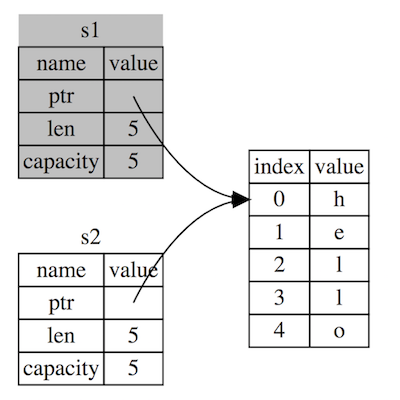

# Rust Ownership

---

## Agenda

- 메모리관리 전략
- Ownership

---

## 메모리관리 전략

- Garbage Collection (ex. Java, Python..)
- 메모리 할당, 해제를 프로그래머가 직접 명시 (ex. C..)

Rust 는 둘 다 아니다 !!
**Ownership** 시스템을 통해 메모리를 관리.

---

## Ownership


Rust 를 잘 활용하기 위해서는 꼭 알아두어야됨!

---

### Ownership 규칙

- 러스트의 각각의 값은 해당값의 오너(owner)라고 불리우는 변수를 갖고 있다.
- 한번에 딱 하나의 오너만 존재할 수 있다.
- 오너가 스코프 밖으로 벗어나는 때, 값은 버려진다(dropped).


---

### Scope

``` rust
{
    let s = "Hello"; // 여기서부터 s가 유효함
    //...            // 여시거도 s는 유효
}                    // 이제 s는 유효X
```

---

### String

ownership 을 이해하기 위해서 `String` 타입을 이용.

`String` 타입은 메모리에 할당되는 방식이 일반 데이터타입과는 조금 다름

- **일반 데이터 타입**: 변수의 크기가 정해져 있음 -> Stack 영역
- **`String` 타입**: 컴파일 타임에도 변수의 크기를 알 수 없음 -> Heap 영역

---

Heap 영역으로부터 메모리를 할당

- 런타임에 메모리를 os 에게 요청
- 해당 `String` 변수로 할 일이 끝났다면 할당받은 메모리를 돌려준다.

이 두 작업이 이루어져야 한다.

---

``` rust
{
    let s = "Hello"; // 여기서부터 s가 유효함
    //...            // 여시거도 s는 유효
}                    // s는 메모리를 반환한다
```

변수가 scope 에서 나가게 되면 Rust는 `drop` 이라는 특별한 함수를 자동으로 호출함

---

``` rust
let s1 = String::from("hello");
let s2 = s1;

println!("{}, world!", s1);
```

위 코드를 컴파일해보면 

```
error[E0382]: borrow of moved value: `s1`
```

 ???? 왜 이런 에러가...

---

왼쪽은 Stack 영역, 오른쪽은 Heap 영역


Stack 에서는 Heap 영역에 저장된 값이 시작되는 메모리 주소와 얼만큼 이 변수가 차지하는 공간이지를 나타내는 len, capacity 값을 가지고 있다.

---

`s2 = s1` 이 실행되면?


`s2` 는 `s1` 이 할당받았던 메모리공간을 그대로 가르킨다

---

이제 메모리가 해제되는 상황을 생각해보자. 
scope 에 나가게 된 변수들에 대해 메모리 해제가 자동으로 이루어진다.

하지만! `s1`와`s2` 는 같은 공간을 가르킴.
같은 메모리를 해제하려고 한다!

**double free error** ->  메모리 안정성 버그들 중 하나

메모리를 두번 해제하는 것은 **메모리 손상(memory corruption)** 의 원이이 됨 
-> 보안 취약성 문제를 일으킬 가능성이 있음

---

Rust 는 이러한 잠정적인 에러를 막는다.
`s1 = s2` 코드가 실행된 이후 메모리 공간 아래와 같다


"s1이 s2로 **move** 되었다!"

결국 scope 를 나갈 떄 `s2` 만이 메모리 해제를 시도

---

### Stack only Data: Copy

``` rust
let x = 5;
let y = x;
println!("x = {}, y = {}", x, y);
```

이 코드는 왜 에러가 발생하지 않을까요??

**크기가 정해져있는 변수**들은 모두 stack 영역에 값이 저장되기 때문이다.

---

위와 같이 크기가 정해져있는 변수들이 `Copy` trait 라는 것을 가지고 있다.

`Copy` trait 을 갖는 변수는 값이 복사된 이후에도 복사된 원본 변수를 그대로 사용 가능.

`String` 타입 -> `Copy` trait X, `Drop` trait O

> Rust 는 `Copy` 와 `Drop` trait 을 동시에 가질 수 없게 한다.

---

일반적으로 스칼라 변수 -> `Copy` 

- `u32` 와 같은 모든 정수 타입
- 불리언 타입
- `f64` 같은 실수 타입
- 문자 타입
- 튜플

> 튜플은 `Copy` 를 갖는 타입으로 이루어진 튜플의 경우에만. (i32, i32) 는 `Copy` 를 갖지만 (i32, String) 은 그렇지 않다.

---

### 함수에서의 ownership

함수에서 오너십이 동작하는 방식도 크게 다르지 않다.

---

``` rust
fn main() {
    let s = String::from("hello");  // s 가 scope으로 들어옴
    // s의 값이 함수로 `move`
    takes_ownership(s);             
    // ... 여기서부터 s는 유효하지 않다                                    
    let x = 5; // x 가 scope으로 들어옴
    
    // x가 함수로 `move`.
    // 그런데 i32는 `Copy`다. 그러므로 여전히 유효하다.
    makes_copy(x);                  
    //그런데 i32는 `Copy`다. 그러므로 여전히 유효하다.
}
// `some_string`값이 scope으로 들어온다
fn takes_ownership(some_string: String) {
    println!("{}", some_string);
} // `some_string`이 scope에서 나가게 되며 `Drop`이 호출된다.
  // `some_string`의 메모리가 해제된다.

// `some_integer` 가 scope으로 들어온다
fn makes_copy(some_integer: i32) { 
    println!("{}", some_integer);
} // `some_integer`가 scope에서 나가지만 
  //`Drop`이 아니기 때문에 아무일 없이 함수가 종료된다.
```

---

## Reference & Further More

[What is Ownership?](https://doc.rust-lang.org/book/ch04-01-what-is-ownership.html)

[러스트의 꽃, Ownership 파헤치기](https://medium.com/@kwoncharles/rust-%EB%9F%AC%EC%8A%A4%ED%8A%B8%EC%9D%98-%EA%BD%83-ownership-%ED%8C%8C%ED%97%A4%EC%B9%98%EA%B8%B0-2f9c6b744c38)

[Ownership in Rust, Part 1](https://medium.com/@thomascountz/ownership-in-rust-part-1-112036b1126b)

[References and Borrowing](https://doc.rust-lang.org/book/ch04-02-references-and-borrowing.html)

[오너십의 참조와 대여](https://medium.com/@kwoncharles/rust-%EC%98%A4%EB%84%88%EC%8B%AD-%EC%B0%B8%EC%A1%B0-%EB%8C%80%EC%97%AC-16f825aaa882)
